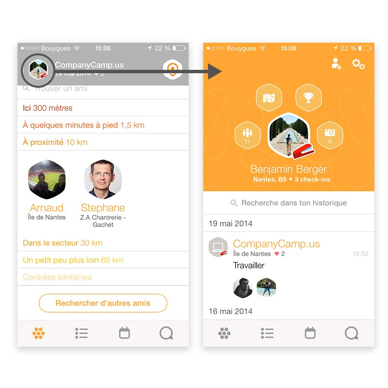
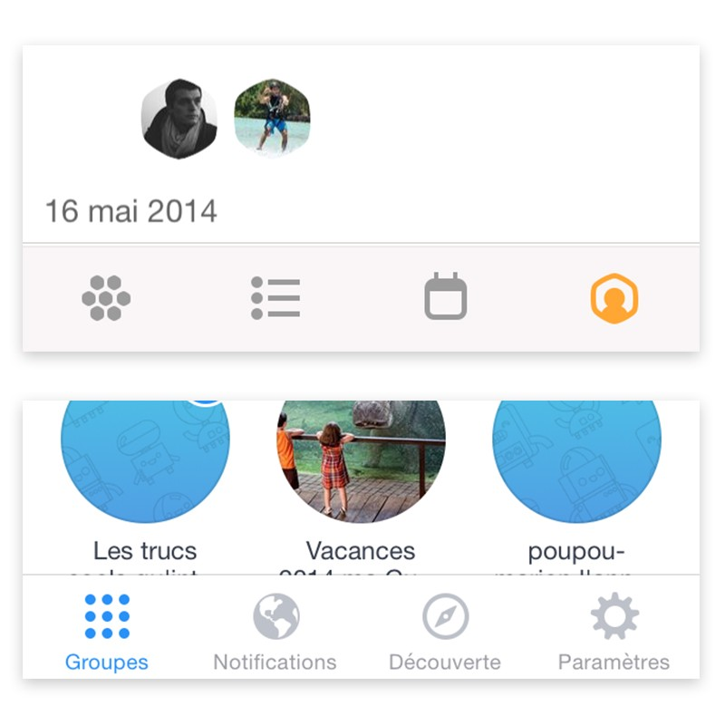
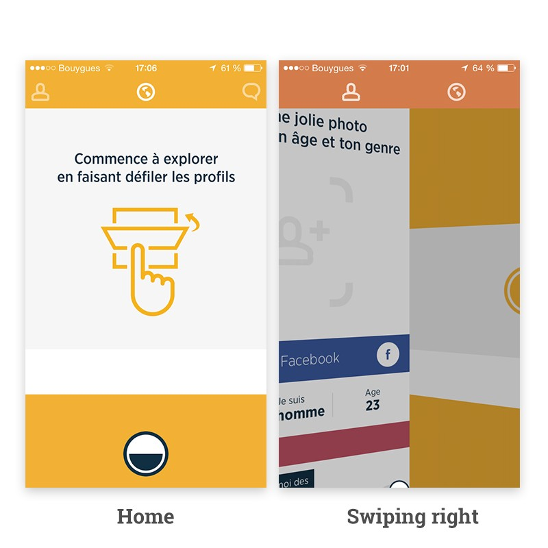
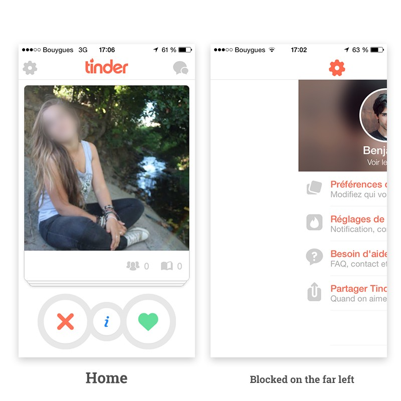
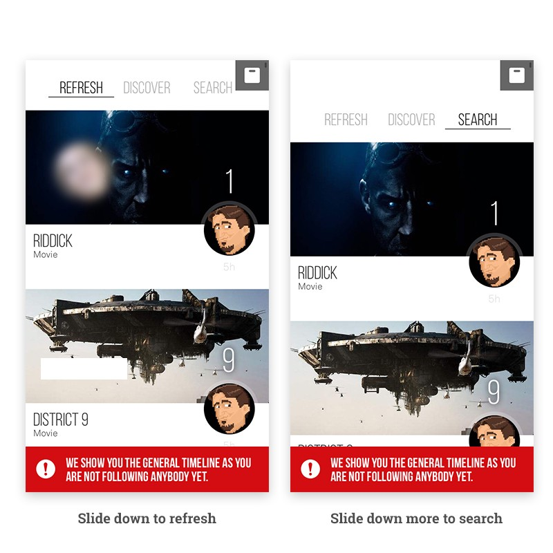
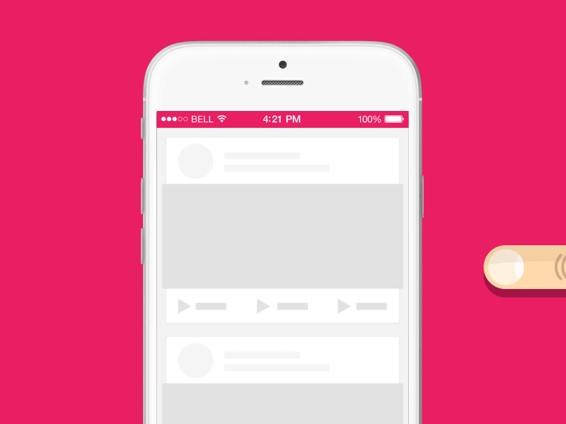

# Mobile Navigation

很久没写过文章了，今天画完原型决定还是把这个习惯保持下去，也算是日后一个可以看得到的存档。
---- 
今天来说说设计方面的东西。

在Medium上看到一篇比较好的文章，名字叫”Mobile Navigaion“，作者叫Benjamin Berger（太长了，懒得打字(⊙o⊙)，以下直接叫Ben），Ben大致围绕着移动端应用的几种流行菜单模式为主要内容，从另一个角度谈了一些看法。仔细研究之后，确实收益匪浅，发出来与大家分享。

Ben个人的确认为抽屉菜单确实是个简单的方案，但同时也有很多的不足：
- 效率低（交互慢）
- 可视化差（隐藏了菜单）
- 包含很多没用的东西

那么问题来了，So what are the others patterns you can use?

每一款产品的诞生都是为了特定的人群而存在，所以在做产品和设计的时候要非常注重经验，因为很多交互对设计人员是非常明显的，但注意，不是对所有人都那么明显。我们来看看Ben对列举的例子有什么新的看法。

## Swarm and Tab bar Menus

Foursquare在2014年5月发布在第一版Swarm的时候，用户想查看个人页时，只能点击左上角的按钮。

Ben觉得这是一个很聪明的作法。有什么更好的方法能比直接用用户的头像来代表“profile button”呢？很明显的，在很多产品关于交互方面的东西，除了设计师，其他人懂的真不多。在一个月后，Swarm更新了他们的导航，并且加了一个个人主页的按钮在她们的tab bar里。相比其他的导航，Swarm用了一个很简单的Tab bar，但是这的确非常有效。

Tab bar很好，即使导航是固定在屏幕上，但显示了所有的导航栏目，严格控制了五个主要的栏目。一个很简单的点击，用户就可以很轻松的从这个页面直接到另一个页面。甚至Facebook，在2010年开始使用抽屉菜单后，在2013年用tab bar代替了它。

但是Ben对Swarm的导航还是给出了自己的建议。比如Ben认为Swarm直接用图标来代替按钮。图标ICON本身已经很好了，而且无需解释这些图标的意思，甚至可以认为是全球通用的语言。但是仍然需要非常容易理解或者直接附上名称。这时Swarm（上图）和Facebook Groups（下图）的导航比较。

Facebook在每一个图标下都加上了名字，甚至在像“设置”这种众所周知的隐喻图标下，都加了文字说明。但是Swarm用了一个自己设计的类似于蜂巢（hive）的图标来作为首页的按钮，其实不是太容易理解的。

不过Ben也说了这有点夸大的成分，来强调有些设计对设计师很明显，但对其他人却不是那样。

## Tinder and Swipe Menus

Ben在第二部分着重对Tinder，Snapchat等运用了侧滑菜单的App进行分析。

在单手操作使用手机时，这种模式的菜单，似乎看起来很是一个很“自然的体验“。Tinder应用给人的感觉就像一个大的水平的屏幕，用户不会离开当前的页面但是依然可以获取不同的信息和进行不同的操作，于是Tinder就运用了滑动（Swipe）这个交互，非常不错，相比点击（Tap）操作，用户的手基本不用脱离于屏幕。

但另一方面来说，用户在Tinder中，无法很快速的到达”Moments“页面。更重要的是，这个页面在首屏是隐藏的，导致用户需要一定的理解成本，这部分就显得不是很方便。

我们也许会通过”长距离的水平滑动（infinite horizontal swipe）“来改善导航，这样用户似乎就可以去下一个页面。但这样的方式，会让用户在长距离向左或者右操作室，产生一种被blocked的感觉。

## BAG and Vertical Swipe Menus

Ben介绍了一款不是很有名叫做BAG的App，使用了一种由设计师Nacho Rapallo设计的新的导航形式。用户可以在下滑屏幕刷新，但是，在滑动的距离不同，会进行不同的操作。

Ben本人很喜欢这个交互，这个操作很想是个抽屉菜单(Hamburger menu)但缺避免了很多的缺点。
- 可以进入完整的菜单
- 在屏幕上也不会浪费空间
- 允许存在多于五个的栏目
- 它很快

在抽屉菜单很主要的一个问题就是用户首先需要点击一个图标或者按钮，然后等待菜单响应，展开，之后再去点击其中的一个栏目，之后再继续等待动画，最后用户才到达了想要的页面。如果很不幸的选择错了页面，那就只能start over again，再来一发吧，骚年，LOL。这样的操作的确很浪费时间。

通过BAG这种导航形式，你可以到达任何和选择任何一个栏目甚至不用将手离开屏幕。

但是，当然了，凡事都不能绝对，类似于BAG的导航，如果用户在滚动timeline查看下部分内容时，这种导航将无法继续使用了，用户想回到导航操作，则需要首先回到timeline的最顶端，或者添加一个back to top的按钮，这样才能继续BAG的导航的操作。

作为一个不同其他的导航，它还需要类似于指导来告诉用户如何使用。很难预料到你的产品定位和用户对这类新型导航的反应。Ben非常不建议创业公司使用这类导航，非常容易让早起用户感觉困惑。

## Navigation experiment
在Ben说了那么多之后，毅然决然了试验了一种新型导航，来避免BAG导航的缺点。Ben依旧才去了BAG导航的模式，但用在了侧面，这样就彻底解决了滚动的问题。

Ben自己也承认说肯定不是最完美的，因为主菜单依旧是隐藏了，最后只能靠用户来习惯这种导航的模式，而且在iOS系统上，手势还存在着侧滑回到上一页”back to the last page“的问题。但是Ben认为这种类型的抽屉导航，还是可以解决交互方面的问题的。

## 那么到底如何选择导航？How to choose a navigation?

说最完美的解决方案，肯定是没有。众口难调，每一款App产品都不一样，因此不可能来设计一个万金油全适配的导航。

即使抽屉菜单有时候确实是最好的方案。看看Facebook的App，每个人开始使用抽屉导航，习惯抽屉导航，但是Facebook最后用tab bat导航来替换了抽屉。Tab bar确实很好，用户可以在不同的页面来回自如的切换，而且反应迅速，但是Ben依旧认为，只是在首页最好的显示方法。

Facebook的App，用户经常遇到的，
- 活动信息流
- 朋友邀请
- 私信
- 消息提示
- 很多没有被分类的东西

在这些里面，其实只有信息流和消息提示是有用的，但是仍然部分的屏幕因为tabbar而隐藏起来。

这样一对比，似乎抽屉菜单倒是更加好的解决方案了。

## Ben的做法
UE和UI在产品的地位很重要，也必须很有效。当很多的页面被分类时，Ben会根据重要程度和平率来重新梳理他们，来确定到底哪些东西是用户需要在页面上的。

当然依旧可以通过用户使用beta测试的办法来分析和改进产品的界面和体验。

设计导航是一件很需要逻辑的事情。一个好的导航，是只需要用户最多最多两次点击，就可以立即获取想要的信息。
---- 
好了，文章略长，不过干货还是不少的。
点击”阅读原文“，还是听首歌，放松放松吧。